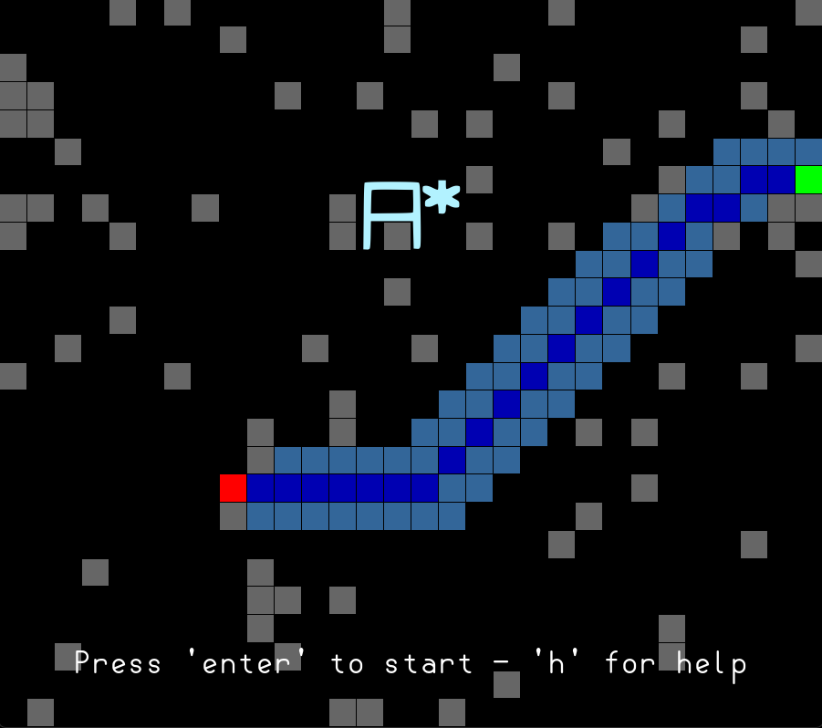

 

AStar (A*) is a visualization of the A* algorithm made in Lua using löve2d. The Algorithm is often used in video games for pathfinding or in networking. The programm allows to (almost) instantly render the algorithm or show an animation of its calculation. It also generates random grid while waiting in the menu.

 

 

# Controls
- Left Mouse Button - draw walls, move start and end point
- T - Toggle animation
- Q/E -  Decrease/Increase animation speed
- R - Redo A* algorithm (only useful for animation)
- C - Clear grid
- F5 - Toggle some Debug infos

# Features
- Visualization of the A* Algorithm
- Draw Walls
- Move start and end node
- Toggle between instant or animation rendering
- Menu with random grids showing the algorithm

# Run
- Play the game on https://astar.jamedev.top 
- Download the executeables from the latest release (Windows)
- Download the .love file from the latest release and run via love (System independet)
- Build it yourself 

# Development
This game was made using 
- Lua 5.4.8
- Love2D 11.5

# Commits
This Github project uses Conventional Commits. I would recommend installing the following extension: 
[Conventional Commits](https://marketplace.visualstudio.com/items?itemName=vivaxy.vscode-conventional-commits)

# License
This project is published under the [MIT LICENSE](LICENSE)

# Other
**Useful ressources**: 
- [A* Algorithm Tutorial](https://www.datacamp.com/tutorial/a-star-algorithm)
- [A* Algorithm Explanation](https://www.reddit.com/r/explainlikeimfive/comments/rkgci6/eli5_how_does_a_pathfinding_work/)

This project is made for hackclubs siege event main week 10 (week 14 total)

 

